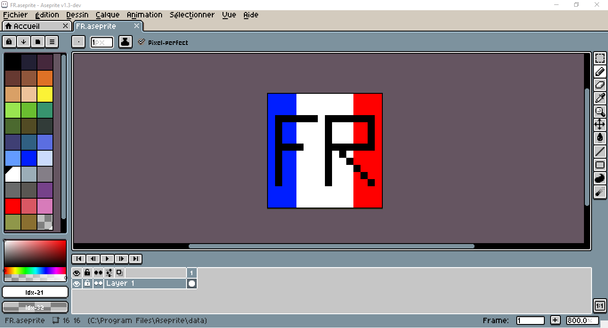

# Aseprite-French-Translation
A french translation of Aseprite software.

## Install
### Method 1
* Just download the [.zip file](https://github.com/chamalowmoelleux/Aseprite-French-Translation/releases) and put where you want
* Launch Aseprite and go to Preferences > Extension > Add Extension and choose the zip file
* Go to Preferences > General > Language > fr (you might have to restart Aseprite)
### Method 2
* Put the content of the [.zip file](https://github.com/chamalowmoelleux/Aseprite-French-Translation/releases) in C:\Path_To_Aseprite_Folder\data\extension\a_folder_you_name_how_you_want
* Launch Aseprite and go to Preferences > General > Language > fr
### Method 3
* Put the fr.ini file of the [.zip file](https://github.com/chamalowmoelleux/Aseprite-French-Translation/releases) in C:\Path_To_Aseprite_Folder\data\strings
* Launch Aseprite and go to Preferences > General > Language > fr
