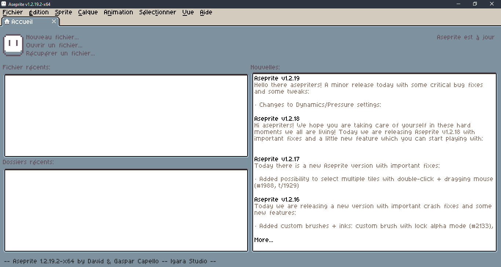

# Aseprite French Translation 
**Une traduction française du logiciel Aseprite.**

A french translation of Aseprite software.

## Installation
### Méthode 1
* Il suffit de télécharger le [fichier .aseprite-extension](https://github.com/chamalowmoelleux/Aseprite-French-Translation/releases) et de le mettre où vous voulez
* Ouvrez-le, et Aseprite devrait se lancer en vous demandant si vous voulez installer l'extension. Acceptez-la.
* Allez dans Preferences > General > Language > fr (vous devrez peut-être redémarrer Aseprite)
### Méthode 2
* Il suffit de télécharger le fichier [fichier .aseprite-extension](https://github.com/chamalowmoelleux/Aseprite-French-Translation/releases) et de le mettre où vous voulez
* Lancez Aseprite et allez dans Préférences > Extension > Ajouter une extension et choisissez le fichier "aseprite-extension" que vous avez téléchargé
* Allez dans Preferences > General > Language > fr (vous devrez peut-être redémarrer Aseprite)
### Méthode 3
* Il suffit de télécharger le fichier [fichier .aseprite-extension](https://github.com/chamalowmoelleux/Aseprite-French-Translation/releases) et de copier le fichier fr.ini du fichier .aseprite-extension (l'ouvrir comme un fichier .zip) dans C:\chemin_vers_le dossier_de_aseprite\data\strings
* Lancez Aseprite et allez dans Preferences > General > Language > fr (vous devrez peut-être redémarrer Aseprite)
---
## Install
### Method 1
* Just download the [.aseprite-extension file](https://github.com/chamalowmoelleux/Aseprite-French-Translation/releases) and put where you want
* Open it, and Aseprite should launch asking you if you want to install the extension. Accept it.
* Go to Preferences > General > Language > fr (you might have to restart Aseprite)
### Method 2
* Just download the [.aseprite-extension file](https://github.com/chamalowmoelleux/Aseprite-French-Translation/releases) and put where you want
* Launch Aseprite and go to Preferences > Extension > Add Extension and choose the `.aseprite-extension` file you downloaded
* Go to Preferences > General > Language > fr (you might have to restart Aseprite)
### Method 3
* Just download the [.aseprite-extension file](https://github.com/chamalowmoelleux/Aseprite-French-Translation/releases) and put the fr.ini file of the .aseprite-extension file (open it like a .zip file) in C:\Path_To_Aseprite_Folder\data\strings
* Launch Aseprite and go to Preferences > General > Language > fr
