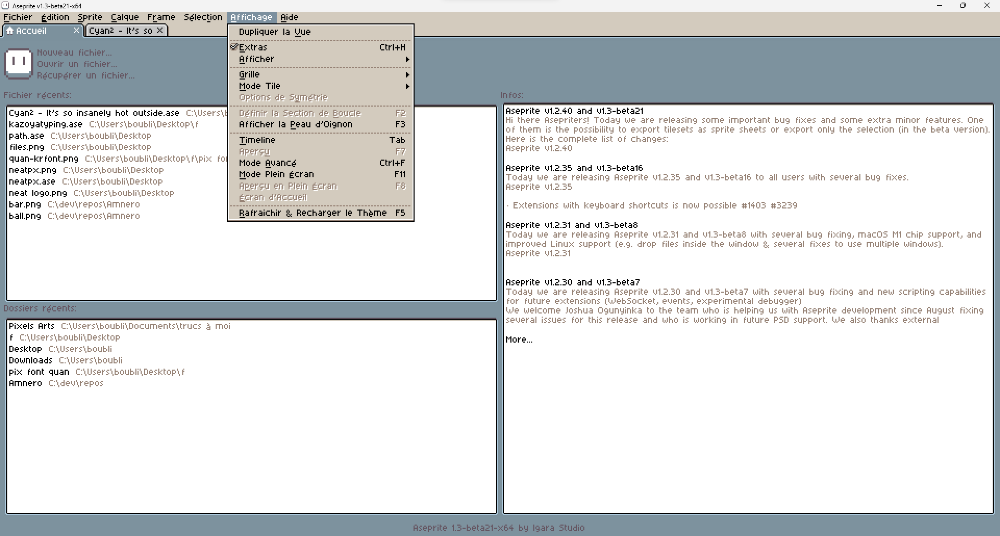

  
   
  

# Installation

* Téléchargez le [fichier .aseprite-extension](https://github.com/boubl/Aseprite-French-Translation/releases)
* Ouvrez-le fichier avec Aseprite, et il devrait vous demander si vous voulez installer l'extension (bug d'Aseprite, la fenêtre des paramètres ne doit pas être ouverte afin que la popup s'affiche).
* Allez dans Preferences > General > Language > Français

> Info: Redémarrer Aseprite permet d'appliquer correctement tout les changements
